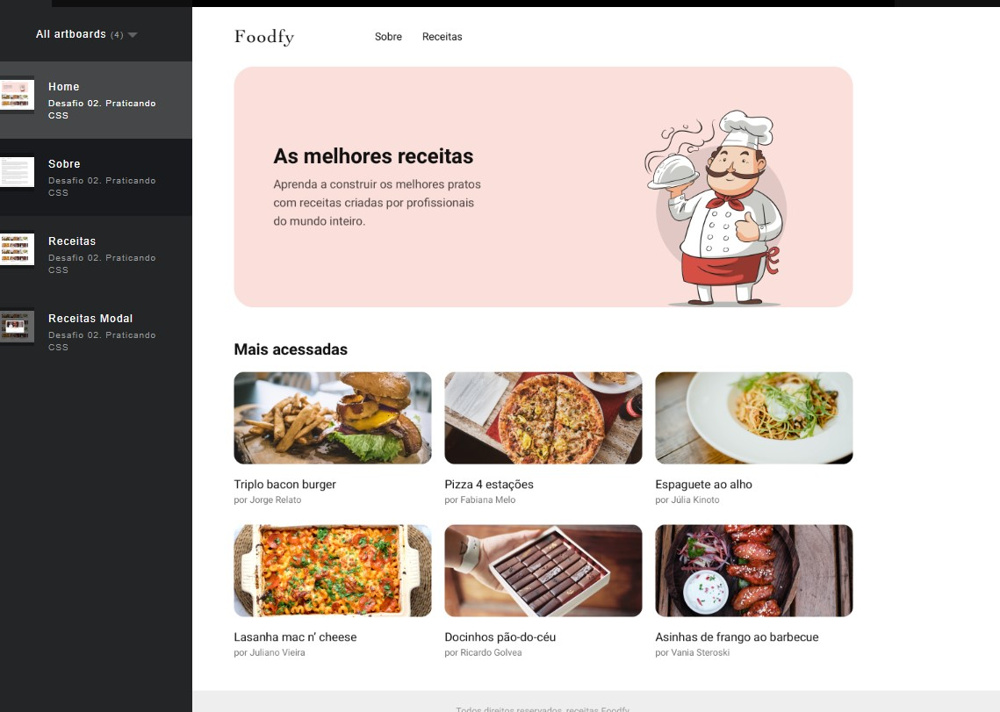
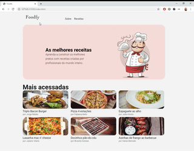
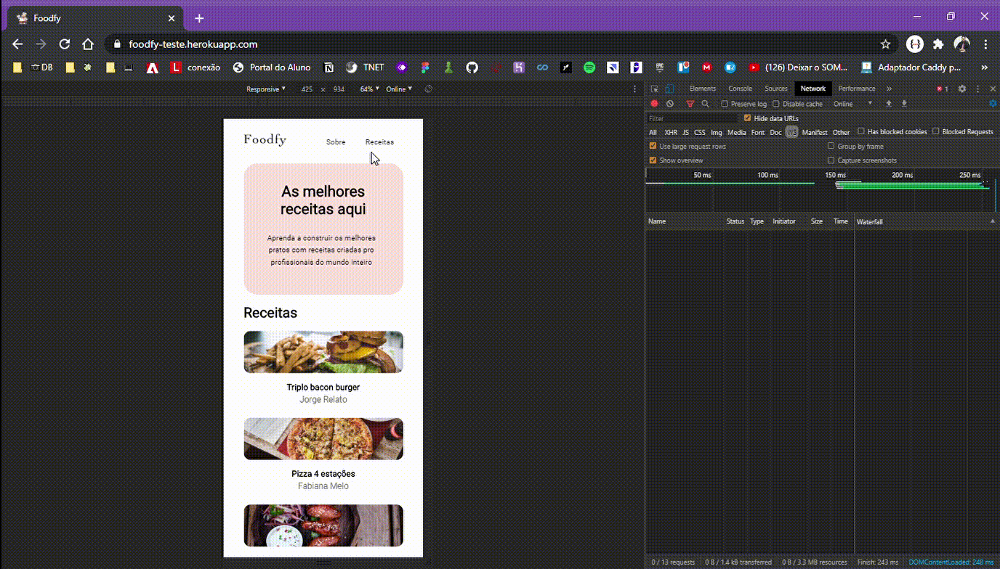

<h1 align="center">
    
</h1>

<h1 align="center">
⚔ Desafio : Construindo o Foodfy
</h1>

<h1 align="center">
    
</h1>

## Indice
- [Sobre o desafio](#-sobre-o-site)
- [Do que se constitnuia o desafio](#-Do-que-se-constituia-o-desafio)
- [Tecnologias utilizadas no frontend](#-Tecnologias-utilizadas-no-frontend)
- [Sobre o desafio parte backend](#Sobre-o-desafio-parte-backend)
- [Objetivo](#-Objetivo)
- [Tecnologias utilizadas no backend](#-Tecnologias-utilizadas-no-backend)
- [Apresentação de Telas](#-Apresentação-do-projeto)

## Sobre o site

- O site Foodfy é resultado de um desafio presente no Bootcamp LaunchBase da Rocketseat. Trata-se de um site onde o usuário pode encontrar diversas receitas criadas por vários chefs.

## Do que se constituia o desafio?

- Foi entregue o layout de um site, o Foodfy, da seguinte forma:

- A partir desse layout nosso trabalho era criar o site do zero, mantendo o design do layout, criando a página "Sobre", a página "Receitas" e o modal que abre na página "Receitas" (o mesmo foi descontinuado no projeto) quando o usuário clica em alguma receita, ampliando-a.

--- 

##  Tecnologias utilizadas no frontend

- 🚀 HTML
- 🚀 CSS
- 🚀 JavaScript

---

<h1 align="center">
Exemplo com modal

</h1>

## Sobre o desafio parte backend:

- A segunda parte, apresentada após o fim do módulo "Iniciando no Back-end" é o processo de refatoração do site criado no desafio do módulo anterior.

## objetivo

- O nosso objetivo era por em pratica as tecnologias backend com dinamismo e rotas. Neste projeto colocamos em prática uma temaplate engine que nos auxiliou na dinamica do frontend.

## Tecnologias utilizadas no backend:

- 🚀 Node.js
- 🚀 Express
- 🚀 Nunjucks

---
## Apresentação do projeto
<h1 align="center">
    Tela web
    
    Tela celular
    
    Outras telas
    
</h1>

Desenvolvido por © Alef Oliveira